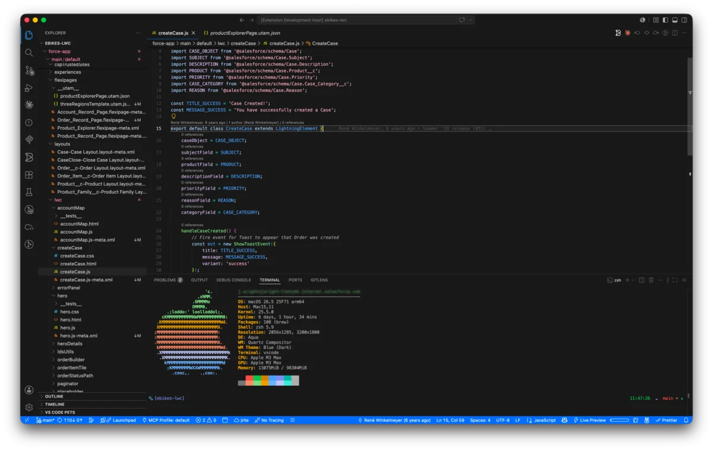
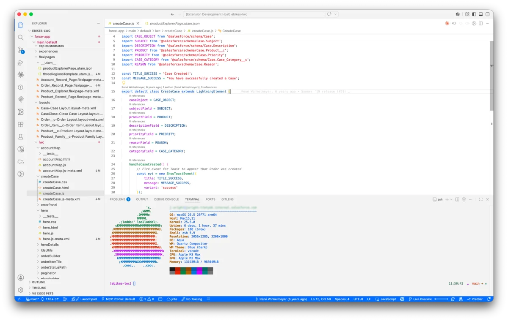

# Salesforce Cosmos Themes

<div align="center">
  <p><em>Salesforce Cosmos Dark</em></p>
  
</div>

<div align="center">
  <p><em>Salesforce Cosmos Light</em></p>
  
</div>

Dark and light color themes for Visual Studio Code derived from the [Salesforce Lightning Design System (SLDS2)](https://www.npmjs.com/package/@salesforce-ux/design-system-2) Cosmos palette. Every color is traceable to an SLDS design token — no ad-hoc hex values.

## Themes

### Salesforce Cosmos Dark

A low-light theme built on SLDS neutral base 90 (`#181818`) with high-contrast syntax colors tuned for extended sessions. Activity bar and sidebar icons are intentionally dimmed to keep focus on code.

### Salesforce Cosmos Light

A bright theme built on neutral base 100 (`#ffffff`) with vibrant, WCAG-compliant syntax highlighting and Salesforce-blue accents.

## Features

- **SLDS2 token-derived** — colors sourced from the `@salesforce-ux/design-system-2` npm package, mapped through a [semantic token layer](./resources/cosmos-tokens-full.json)
- **WCAG contrast audited** — text and UI elements meet AA contrast ratios
- **Semantic highlighting** — leverages VS Code's semantic token API for richer language coloring
- **Full-surface coverage** — editor, terminal, diff viewer, git decorations, breadcrumbs, peek views, merge conflicts, and minimap all themed consistently
- **Subdued chrome** — sidebar icons, list selections, and activity bar are dialed back so the editor content stays prominent

## Installation

1. Open VS Code
2. Go to Extensions (`Cmd+Shift+X` / `Ctrl+Shift+X`)
3. Search for **"Salesforce Cosmos Themes"**
4. Click Install
5. Open the Command Palette (`Cmd+Shift+P`) → **Preferences: Color Theme** → select **Salesforce Cosmos Dark** or **Salesforce Cosmos Light**

### From source (development)

1. Clone the repo: `git clone git@github.com:forcedotcom/salesforcedx-vscode-themes.git`
2. Open the folder in VS Code
3. Press `F5` to launch an Extension Development Host
4. Select **Salesforce Cosmos Dark** or **Salesforce Cosmos Light** from the color theme picker

## Color Palette

### Dark

| Role | Hex | SLDS Token |
|------|-----|------------|
| Canvas | `#181818` | `--slds-g-color-neutral-base-90` |
| Elevated surface | `#242424` | `--slds-g-color-surface-1` |
| Primary text | `#c9c9c9` | neutral base 20 |
| Primary blue | `#7cb1fe` | electric blue 45 |
| Accent | `#066afe` | electric blue 50 |
| Error | `#ff538a` | error base |
| Warning | `#e4a201` | warning base |
| Success | `#01c3b3` | success base |

### Light

| Role | Hex | SLDS Token |
|------|-----|------------|
| Canvas | `#ffffff` | `--slds-g-color-neutral-base-100` |
| Elevated surface | `#e5e5e5` | `--slds-g-color-neutral-base-90` |
| Primary text | `#181818` | neutral base 10 |
| Primary blue | `#066afe` | electric blue 50 |
| Accent | `#0176d3` | Salesforce blue |
| Error | `#ea001e` | error base |
| Warning | `#a96504` | warning base |
| Success | `#0b827c` | success base |

## Token Architecture

The themes use a three-layer token system:

1. **SLDS2 primitive tokens** — raw palette values from `@salesforce-ux/design-system-2`
2. **Semantic tokens** — mapped in [`resources/cosmos-tokens-full.json`](./resources/cosmos-tokens-full.json) with categories like `surface`, `text`, `border`, `state`
3. **VS Code workbench colors** — the final theme JSON files that VS Code consumes

This indirection means updating to a new SLDS2 release only requires remapping the semantic layer, not rewriting 2000+ individual color assignments.

## Development

```sh
npm install          # pulls @salesforce-ux/design-system-2
npm run optimize-images   # compress preview screenshots
```

The theme files live in `themes/` and are plain VS Code color theme JSON. The token reference in `resources/cosmos-tokens-full.json` documents the mapping rationale for each workbench color key.

## Contributing

Issues and pull requests welcome at [forcedotcom/salesforcedx-vscode-themes](https://github.com/forcedotcom/salesforcedx-vscode-themes).

## License

MIT — see [LICENSE](./LICENSE).
