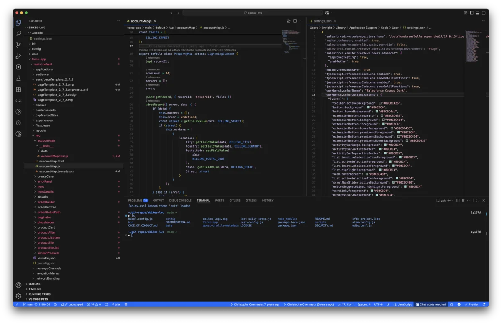
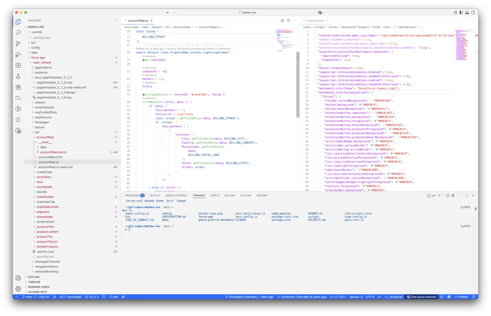

# Salesforce Cosmos Themes

<div align="center">
  <p><em>Salesforce Cosmos Dark Theme</em></p>
  
</div>

<div align="center">
  <p><em>Salesforce Cosmos Light Theme</em></p>
  
</div>

Beautiful, accessible color themes for Visual Studio Code based on the Salesforce Lightning Design System Cosmos Theme. This extension provides both light and dark themes that follow Salesforce's design principles and use authentic SLDS design tokens.

## 🎨 Themes

### Salesforce Cosmos Light

A clean, bright theme perfect for daytime coding with excellent contrast and readability.

- **Background**: Light neutrals for reduced eye strain
- **Syntax highlighting**: Vibrant, accessible colors
- **UI elements**: Consistent with Salesforce Lightning interface
- **Terminal**: Integrated color scheme for seamless experience

### Salesforce Cosmos Dark

A sophisticated dark theme designed for low-light environments and extended coding sessions.

- **Background**: Deep, rich neutrals
- **Syntax highlighting**: High-contrast colors optimized for dark backgrounds
- **UI elements**: Maintains Salesforce brand consistency
- **Terminal**: Coordinated dark color palette

## ✨ Features

- **🎯 SLDS Design Tokens**: Built using authentic Salesforce Lightning Design System color tokens
- **♿ Accessibility**: Meets WCAG contrast requirements for better readability
- **🔄 Consistent Experience**: Unified color scheme across editor, terminal, and UI elements
- **💡 Smart Highlighting**: Thoughtfully chosen syntax colors for better code comprehension
- **🎨 Brand Aligned**: Colors that reflect Salesforce's visual identity

## 🚀 Installation

1. Open Visual Studio Code
2. Go to Extensions (`Cmd+Shift+X` on macOS or `Ctrl+Shift+X` on Windows/Linux)
3. Search for "Salesforce Cosmos Themes"
4. Click Install
5. Go to Settings → Color Theme and select either:
   - **Salesforce Cosmos Light** for the light theme
   - **Salesforce Cosmos Dark** for the dark theme

## 🛠 Configuration

The themes work great out of the box, but you can customize them further:

```json
{
  "workbench.colorTheme": "Salesforce Cosmos Light",
  "terminal.integrated.theme": "Salesforce Cosmos Light"
}
```

## 🎨 Color Palette

### Cosmos Light Theme

- **Primary Blue**: `#066afe` (Electric Blue)
- **Background**: `#ffffff` (Pure White) / `#f3f3f3` (Light Gray)
- **Text**: `#181818` (Dark Gray) / `#5c5c5c` (Medium Gray)
- **Accent**: `#0176d3` (Salesforce Blue)

### Cosmos Dark Theme

- **Primary Blue**: `#7cb1fe` (Light Electric Blue)
- **Background**: `#181818` (Dark Gray) / `#242424` (Medium Dark)
- **Text**: `#cccccc` (Light Gray) / `#aeaeae` (Medium Light)
- **Accent**: `#066afe` (Electric Blue)

## 🔗 SLDS Integration

These themes are built using authentic Salesforce Lightning Design System tokens:

- `--sds-g-color-neutral-base-*` for backgrounds and text
- `--sds-g-color-palette-electric-blue-*` for primary actions
- `--sds-g-color-error-base-*` for error states
- `--sds-g-color-success-base-*` for success states
- `--sds-g-color-warning-base-*` for warning states

## 📝 Changelog

See [CHANGELOG.md](CHANGELOG.md) for release notes and version history.

## 🤝 Contributing

We welcome contributions! Please feel free to submit issues and pull requests.

## 📄 License

This project is licensed under the MIT License - see the LICENSE file for details.

---

**Enjoy coding with authentic Salesforce colors! ⚡**
